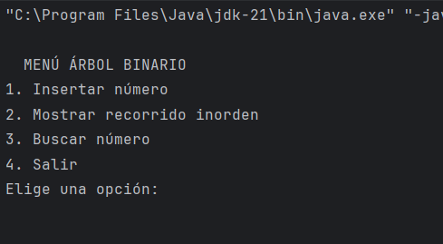
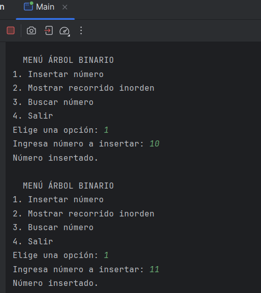
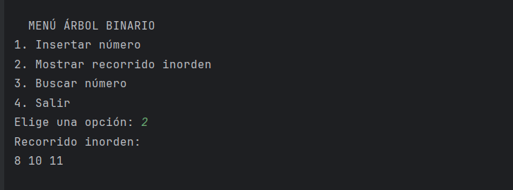
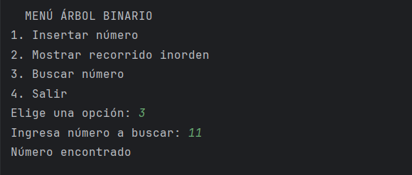
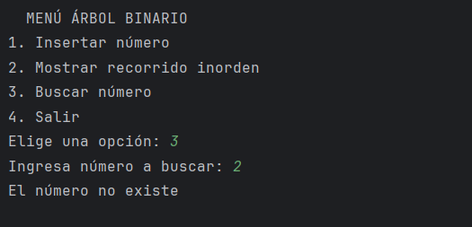

# EA3 - Árbol Binario en Java  

## Descripción
Este proyecto corresponde a la **Actividad EA3 - Árboles** y consiste en la implementación de un **Árbol Binario de Búsqueda (ABB)** en Java.

El programa permite:
- Insertar números en el árbol.
- Mostrar el recorrido inorden (para evidenciar el orden ascendente de los datos).
- Buscar un número dentro del árbol e indicar si existe o no.

El objetivo es comprender la estructura, funcionamiento y aplicación de los árboles binarios en programación.  

## ¿Qué es un árbol binario?
Un **árbol binario** es una estructura de datos jerárquica donde cada nodo puede tener como máximo **dos hijos**:

- Hijo izquierdo
- Hijo derecho

Se utiliza para organizar información de manera que se facilite la búsqueda, inserción y recorrido de los datos.

El **recorrido inorden** (izquierda → raíz → derecha) es importante porque muestra los elementos en orden ascendente en un Árbol Binario de Búsqueda.

---

## Implementación
La implementación se realizó en Java con:

| Clase / Método | Descripción |
|-------|-------------|
| Nodo  | Representa un nodo del árbol, con valor y referencias a sus hijos izquierdo y derecho. |
| ArbolBinario | Contiene los métodos principales del árbol. |
| insertar() | Inserta un número en el árbol manteniendo el orden binario. |
| inorden() | Recorre e imprime los valores en orden ascendente. |
| buscar() | Verifica si un número existe en el árbol. |
| Main  | Contiene el menú en consola para interactuar con el usuario. |

---
## Ejemplo de ejecución en consola

### Menú principal

### Insertar números

### Recorrido inorden

### Buscar número existente

### Buscar número inexistente

---

## Integrantes del grupo
- Yenni Vanessa Delgado Velasco

---
